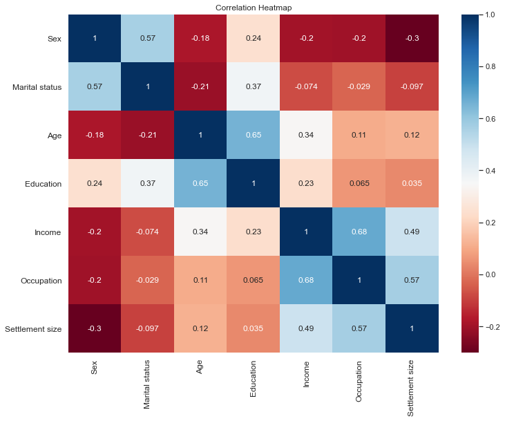
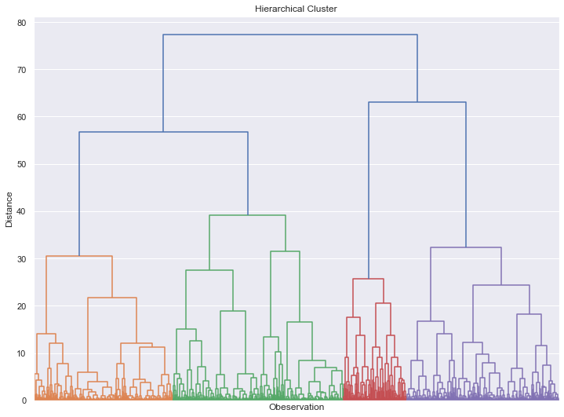

# Customer-Analytics
Customer Analytics with using PCA and K-Means.

## [Segmentation](https://github.com/luffy-17/Customer-Analytics/blob/master/segmentation/Customer_Analytics%20-%20Segmentation.ipynb)
-- This notebook focuses on customer segmentation, using a hands-on approach. It involves the application of hierarchical and flat clustering techniques for dividing customers into groups. It also features applying the Principal Components Analysis (PCA) to reduce the dimensionality of the problem, as well as combining PCA and K-means for an even more
professional customer segmentation.

<!--  -->

### The STP Framework
-- STP is a fundamental marketing framework. It can be applied to all areas of business and marketing activities.
  1. Segmentation: 
      The process of dividing a population of customers into groups that share similar characteristics. 
      Observations within the same group would have comparable purchasing behavior.
      Observations within the same group would respond similarly to different marketing activities.
      
  2. Targeting:
      The process of evaluating potential profits from each segment and deciding which segments to focus on.
      Selecting ways to promote your products. You can target one segment on TV and another online.
      
  3. Positioning:
      What product characteristics do the customers from a certain segment need?
      Shows how a product should be presented to the customers and through what channel.
      In fact, this process is so important, that it has a framework of its own called: Marketing Mix.
        4Ps of Marketing:
            1. Product
            2. Price
            3. Promotion
            4. Place
